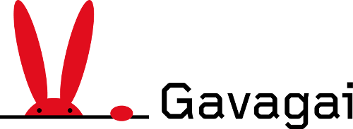

# ParaLex
Paradigmatic term clusters in multiple languages - a resource for evaluating word spaces and other semantic similarity models.

The dataset consists of thematic word lists that represent a number of different semantic 
paradigms, such as days of the week, months of the year and common fruit and vegetables. 
The evaluation data has been translated to more than 45 different languages.

## Download

## Contribute

While we will work to extend the data set to include new languages, and more paradigmatic clusters,
we encourage anyone in the field to contribute to the data set. You can do so by following the [common
GitHub workflow](https://guides.github.com/introduction/flow/): fork the project, make changes to 
it, and submit a pull request.

## License and attribution

The data set licensed under [Apache License 2.0](ParaLex/LICENSE).

When referring to the ParaLex data set, please cite this publication

    @paper{sumbler2018paralex,
        author = {Peter Sumbler and Fredrik Olsson and Nina Viereckel and Lars Hamberg and Jussi Karlgren and Magnus Sahlgren and Maria Verbitskaya},
        title = {ParaLex: A Multilingual Resource for Evaluating Semantic Similarity Models},
        conference = {11th edition of the Language Resources and Evaluation Conference},
        year = {2018},
        pages = {},
        keywords = {Semantic Similarity; Evaluation; Lexical Resources; Word Embeddings; Multilingual Resources},
        url = {}
    }

## About Gavagai

[Gavagai](http://gavagai.se/) is a Swedish language technology company spun off from the 
Swedish Institute of Computer Science. Gavagai builds services such 
as [the Gavagai Explorer](https://explorer.gavagai.se/), 
and [the Gavagai Monitor](http://monitor.gavagai.se/).
